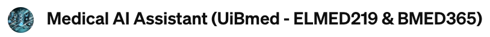
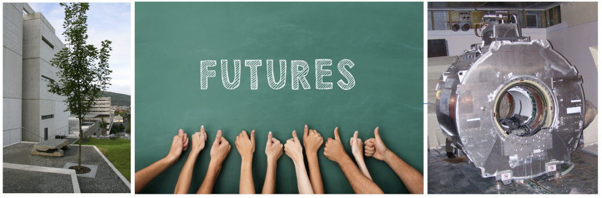

# ELMED219: Artificial intelligence and computational medicine (2025)

  
If you have a subscription to [ChatGPT Plus](https://openai.com/blog/chatgpt-plus), you can also try out the [**Medical AI Assistant (UiBmed - ELMED219 & BMED365)**](https://chat.openai.com/g/g-d90dfN17H-medical-ai-assistant-uibmed-elmed219-bmed365) and see if you can get it to answer some of your questions.

----
<!--

 &nbsp;  &nbsp;   &nbsp;  &nbsp; 

-->
  

#### Course overview
[ELMED219](https://www.uib.no/en/course/ELMED219) examines how artificial intelligence and computational tools are shaping modern healthcare. It is offered in collaboration with the [Department of Biomedicine](https://www.uib.no/en/biomedisin) at the University of Bergen (UiB), the [Department of Computer Science, Electrical Engineering and Mathematical Sciences](https://www.hvl.no/en/about/management/faculty-of-technology-environmental-and-social-sciences/department-of-computer-science-electrical-engineering-and-mathematical-sciences/) at the Western Norway University of Applied Sciences (HVL), and the Medical AI group at the [Mohn Medical Imaging and Visualization Center](https://mmiv.no) (MMIV).

#### What you will learn
This course provides practical knowledge in computational thinking, medical imaging, and the use of machine learning and AI in healthcare. It also addresses ethical and regulatory challenges, giving students a balanced perspective on innovation in medical AI.

#### Practical applications
Through exercises and demonstrations, participants will work on practical applications, including analyzing MRI data, segmenting medical images, building biomarker prediction models, and exploring concepts like [Patient similarity networks](https://pmc.ncbi.nlm.nih.gov/articles/PMC11321866) and [multimodal data analysis](https://www.nature.com/articles/s41591-022-01981-2). The course also introduces large language models ([foundation models](https://en.wikipedia.org/wiki/Foundation_model)) and their potential use in healthcare.

#### Skills and tools
Students will gain experience with Python programming, [Jupyter notebooks](https://docs.jupyter.org), modern AI tools like [ChatGPT](https://chatgpt.com), [Gemini](https://gemini.google.com), and [Claude](https://claude.ai), as well as cloud computing and [AI-assisted coding](https://github.com/resources/articles/ai/ai-coding-tools). Emphasis is placed on open science and reproducible research practices to prepare students for both academic and practical settings.

#### Team project
The course includes a [team project](./Project) where students collaborate to design and build an AI-driven solution to a real healthcare challenge. Teams will take their ideas from concept to prototype and present them as a potential healthcare startup.

#### Why take this course?
ELMED219 is an opportunity to gain valuable skills and insights into the use of AI in medicine and healthcare.

<!--The objective and content of the course address: The computational mindset, imaging, modeling, machine learning, and AI in future medicine, as well as ethical and regulatory aspects of AI. The course is a guided "journey" with a hands-on component through selected computational modeling techniques within biomedical and clinical applications. Examples, demonstrations, and tasks will be related to in vivo imaging (MRI) and segmentation, biomarkers and prediction, [network analysis](https://pmc.ncbi.nlm.nih.gov/articles/PMC11321866) ("patient similarity networks"), [multimodal data](https://www.nature.com/articles/s41591-022-01981-2), as well as large language models ("[foundation models](https://en.wikipedia.org/wiki/Foundation_model)") within medicine and health. Throughout the course, students will use principles and modern tools for data analysis, machine learning, and generative AI (e.g. [ChatGPT](https://chatgpt.com), [Gemini](https://gemini.google.com), [Claude](https://claude.ai)) within medical applications. The course will give the students an introduction to Python and [Jupyter notebooks](https://docs.jupyter.org), use of [AI-assisted coding](https://github.com/resources/articles/ai/ai-coding-tools), and the "cloud" for access to open data, calculations, and knowledge, as well as insight into and rationale for "open science" and "reproducible research". All course material is openly available on this GitHub repository. (See also [BMED365](https://github.com/MMIV-ML/BMED365))
-->

#### Open access materials
All course materials are openly available in this GitHub repository. See also [BMED365](https://github.com/MMIV-ML/BMED365).

#### For enrolled students
**Note**: Students enrolled in the course can find additional practical information on [MittUiB](https://mitt.uib.no/courses/50716).

<!-- - On your own, you are encouraged to spend approximately four hours completing at least one DataCamp course (remember to use the link on MittUiB for free access to DataCamp). Which DataCamp course you're encouraged to do depends on your previous programming experience: 
  - No Python programming experience? Complete the course [Introduction to Python](https://learn.datacamp.com/courses/intro-to-python-for-data-science) 
  - Know some Python, but no machine learning? Complete the course [Supervised Learning with scikit-learn](https://learn.datacamp.com/courses/supervised-learning-with-scikit-learn) 
  - Know the fundamentals of machine learning in Python? Can you pass the *Machine Learning Fundamentals Assessment*? Complete the course [Biomedical Image Analysis in Python](https://learn.datacamp.com/courses/biomedical-image-analysis-in-python)   
-->
-  For **academic questions** about the course, contact course coordinator [Arvid Lundervold](https://www.uib.no/en/persons/Arvid.Lundervold) (UiB).

- For **practical or administrative inquiries**, contact the Studies Section at the Department of Biomedicine at studie.biomed@uib.no

 The content for the course is offered with a <b><a href="http://creativecommons.org/licenses/by-sa/4.0">CC BY-SA 4.0</a></b> license unless otherwise stated.

--------

# Tentative time schedule

> **OBS:** Some of the links are to earlier versions of the course. The content will soon be updated for the 2025 version

| **TIME**                    | ACTIVITY                                                                               |
| --------------------------- | -------------------------------------------------------------------------------------- |
| **WEEK 1:  Fri, Jan 3**   |                                                                                        |
| _On your own_               | Get an [overview of the course](https://docs.google.com/presentation/d/e/2PACX-1vRs-_1Tr_iXzIfy8207VlKuBjr_hCIpQqrI65YM9Q6TcQMUt4R-4aPVPzfL6fwDkmB8UkcPyfyiL9TU/pub?start=false&loop=false&delayms=3000); installation of software and/or test out Google Colab   |
|                             | Follow the instructions at [**setup.md**](./setup.md) and  [MittUiB](https://mitt.uib.no/courses/50716)                |
| **WEEK 2:  Mon, Jan 6**   |                                                                                        |
| 10:15-14:00 BB Hist 1    | Information [About the course](https://docs.google.com/presentation/d/e/2PACX-1vSWy5OFMCYXF74CveeTSkEhuL1zwhKUFVe8Y-_gya6h4RfM7Ce6RP8XifS4QleOo7cPrjZOCdRu_IfW/pub?start=false&loop=false&delayms=3000)   Motivation lectures &nbsp;- [Computational medicine](https://docs.google.com/presentation/d/e/2PACX-1vQdrVW4qt8doyqbxRiZwZNQmGUN1qfML7wP-jYxp4aOJI5B6g8wn4HYNjcJ18w93IUzQBg4yMngsbNl/pub?start=false&loop=false&delayms=3000)  &nbsp;- [Medical AI]()   AI-driven innovation in healthcare  |
|                             | *Arvid and Alexander Lundervold*                                                                     |                                |
| **Wed, Jan 8**    |                                                                                        |
| 14:15-15:00 BB Hist 1    | [SW-installation](./setup.md)  [Tools](https://docs.google.com/presentation/d/e/2PACX-1vRdRU-f2zRfXkuTjIu2xq1tBig-cR2_gauXl3GlQhhB8Yh68wV5qzkySJWHOhU3dfcrNCNBhdZfxSUT/pub?start=false&loop=false&delayms=3000), [[teams](https://docs.google.com/presentation/d/e/2PACX-1vRc51VLi_fbENjJxXWjKg9i8F05IRoDl7TWmXGqbOc-AnmyOS_VaonCzgSOsT0aAgfH1lvHzc2y_F-F/pub?start=false&loop=false&delayms=3000)]             |
|                             | *Arvid and Alexander Lundervold*                                                     |
| 15:15-16:00 BB Hist 1    | [About the course project](./Project)             |
|                             | *Arvid and Alexander Lundervold*                                                               |
| **Fri, Jan 10**    |                                                                                                 |
| 10:15-12:00 BB Hist 1    | [LAB 0: Introduction to theory and tools for machine learning](./Lab0-ML)        |
|                             | *Arvid and Alexander Lundervold*                                                      |
| 12:15-13:00 BB Hist 1    | [LAB 1: Network science and patient similarity networks (PSN)](./Lab0-ML)                                                                                         |
|                             | *Arvid and Alexander Lundervold*                                                                     |
| **WEEK 3: Tue, Jan 14**    |                                                                                       |
| 09:15-13:00 BB Hist 1    | Crash-course in Python programming (with AI-assisted coding); recap of Lab0, Lab1     |
|                             |  *Arvid and Alexander Lundervold*                                                                     |
| **Fri, Jan 17**   |                                                                                                  |
| 08:15-13:00 BB Hist 1    |  [Lab 2: Deep learning](./Lab2-DL)                                                     |
|                             | *Arvid Lundervold*                                        |
| **WEEK 4: Team project**  |  Joint with BMED365 - Working on project in interdisciplinary teams (during the week)  |
| **Tue, Jan 21**   |                                                                                        |
| 09:15-12:00 BB Hist 1    | [Lab 3: Generative AI and Large Language Models](.)                           |
|                             | *Alexander Lundervold*                                                                     |
| 13:15-16:00 BB Hist 1    | Meet-up for team project brainstorming and coaching                                    |
|                             | *Arvid and Alexander Lundervold*                                                              |
|  **WEEK 5: Tue, Jan 28**  |                                                                                        |
| 08:15-10:00 BB Hist 1    | Project presentations by team  (jointly with BMED365)                                  |
|                             | *Arvid and Alexander Lundervold*                                                      |
| **Thu, Jan 30**   |                                                                                        |
| 16:00                       | Deadline for the Team Project Report - joint with BMED365 (hand in via MittUiB)        |
|**Fri, Jan 31** | 
||[**Home exam**](./Exam#readme): Duration: 2 hours;   Assignment is handed out: 31.01.2025, 13:00;  Submission deadline: 31.01.2025, 15:00;  Examination system: Inspera Digital exam

### Previous versions of the ELMED219 course

| **Year**                    | Link             |
| --------------------------- |  --              | 
|2024 |https://github.com/MMIV-ML/ELMED219-2024       |
|2023 |https://github.com/MMIV-ML/ELMED219-2023       |
|2022 |https://github.com/MMIV-ML/ELMED219-2022  |
|2021 |https://github.com/MMIV-ML/ELMED219-2021  |
|2020 |https://github.com/MMIV-ML/ELMED219-2020  |
|2019 |https://github.com/MMIV-ML/ELMED219x-2019 |

### Previous versions of the BMED360 course
_"In Vivo Imaging and Physiological Modelling"_

| **Year**                    | Link             |
| --------------------------- |  --              | 
|2021 |https://github.com/computational-medicine/BMED360-2021 |
|2020 |https://github.com/computational-medicine/BMED360-2020 |

### Previous versions of the BMED365 course
_"Computational imaging, modelling and AI in biomedicine"_

| **Year**                    | Link             |
| --------------------------- |  --              | 
|2024 |https://github.com/MMIV-ML/BMED365-2024 |
